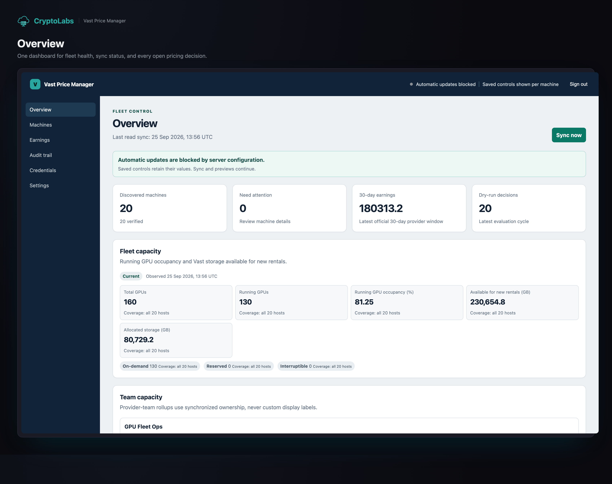
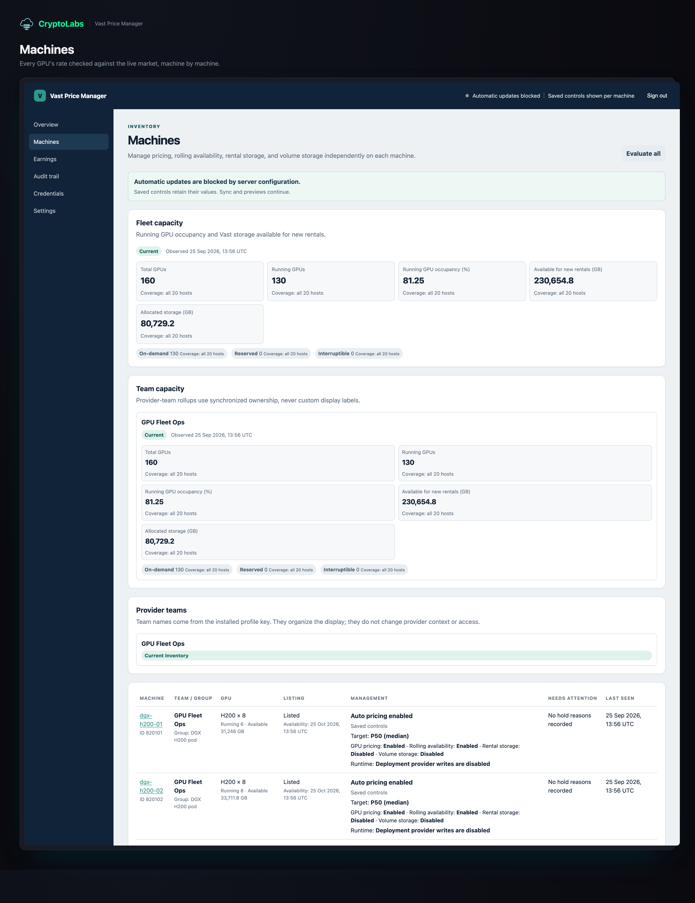
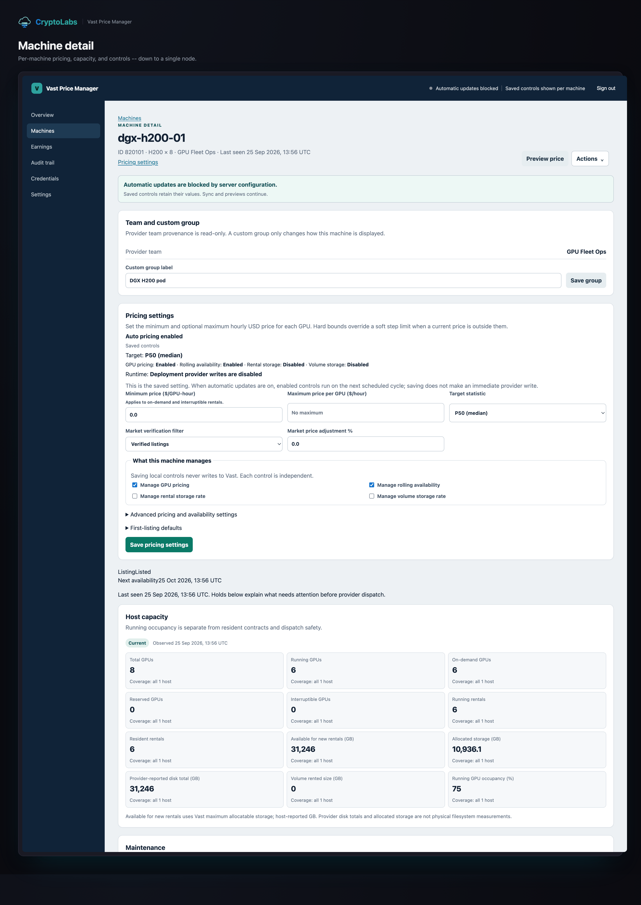
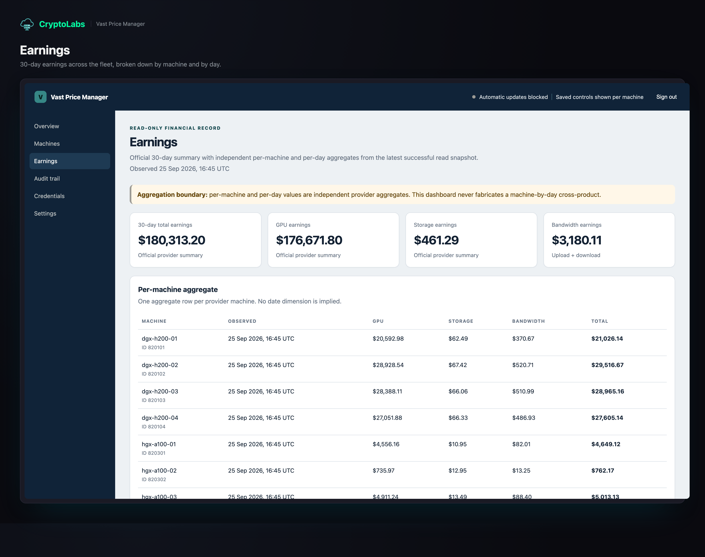
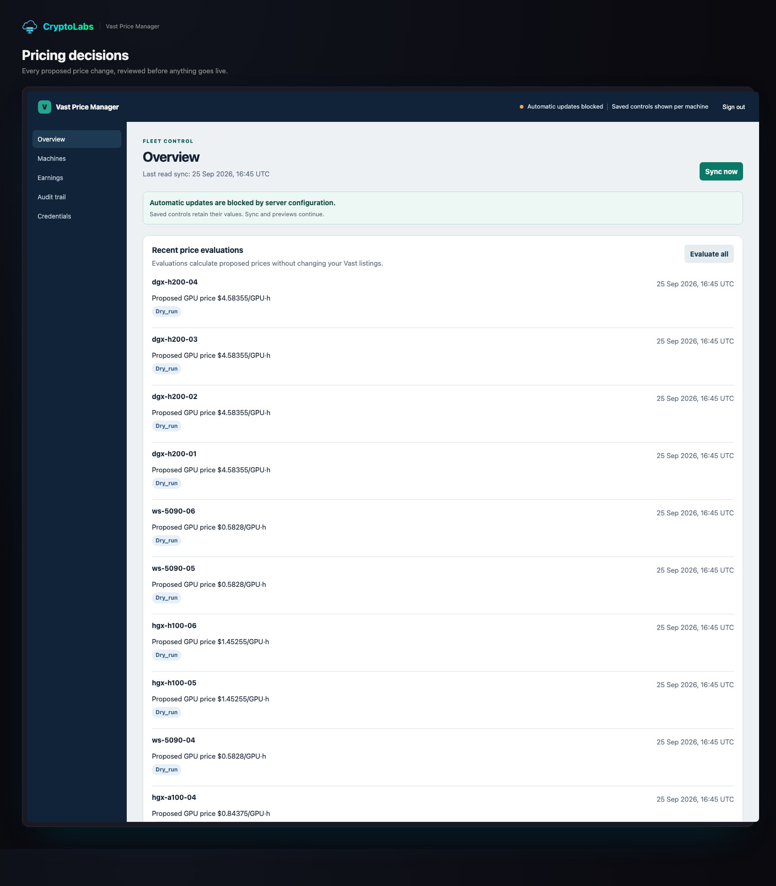
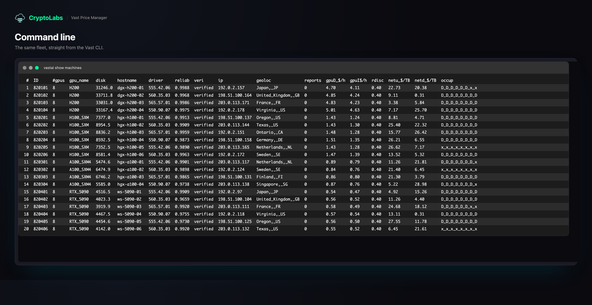

# Vast Price Manager (VPM)

*A self-hosted dashboard that watches your Vast.ai machines, prices them for you, and never touches a live listing until you say so.*

<p align="center"></p>

## What it does

- **Watches.** Syncs your machine inventory, ownership, and earnings from Vast.ai — read-only.
- **Prices.** Tracks the market price per GPU type and drafts dry-run pricing/end-date decisions until you turn writes on.
- **Tests.** Runs Vast's own machine self-test once you install the optional Vast CLI — see [docs/self-test.md](docs/self-test.md).
- **Logs.** Keeps an audit trail of every decision and command it runs.
- **Locks.** One admin account, with the password re-checked before every sensitive action.

## Quickstart

Needs Docker and Docker Compose. About 10 minutes.

1. Get `compose.yml`, `Caddyfile`, and `.env.example` (clone this repo, or download the three files) and open a terminal there.
2. Copy the env template, then set `VPM_IMAGE` to the pinned image from [RELEASES.md](RELEASES.md) (verify first with [docs/verify-image.md](docs/verify-image.md); never `:latest`).

   ```sh
   cp .env.example .env
   ```

3. Generate the master key — VPM's container runs as UID 999, so the `chown` below is required, not just `chmod` (see [docs/troubleshooting.md](docs/troubleshooting.md#master-key-not-readable)).

   ```sh
   docker run --rm "$(sed -n 's/^VPM_IMAGE=//p' .env)" \
     python -c "from cryptography.fernet import Fernet; import sys; sys.stdout.buffer.write(Fernet.generate_key())" \
     > master.key
   sudo chown 999:999 master.key && sudo chmod 400 master.key
   ```

4. Start the stack and set up the database.

   ```sh
   docker compose up -d
   docker compose exec vpm vpm init-db
   ```

5. Open `https://localhost` (or your `HOST_HTTPS_PORT`), click through the local certificate warning, then continue in **[docs/first-run.md](docs/first-run.md)** to log in, add your Vast API key, and turn writes on when you're ready.

## Screenshots

VPM's real interface, on a sample fleet spanning DGX H200, H100 SXM, HGX A100, and RTX 5090 machines. The CLI screenshot uses the real `vastai show machines` column layout.

<p align="center">





</p>

## Safe by default

- **Off by default.** Writes are disabled until you turn them on yourself, twice, on purpose.
- **Held, not guessed.** Any missing or contradictory fact makes VPM leave a machine alone.
- **Encrypted key.** Your Vast API key is encrypted at rest, with its master key kept outside the data volume.
- **HTTPS-only.** Login always needs TLS in front of VPM — this repo ships that for you. Full details: [docs/safety.md](docs/safety.md).

## Docs

- [docs/first-run.md](docs/first-run.md) — admin login, your Vast account ID, adding your API key, enabling writes.
- [docs/configuration.md](docs/configuration.md) — every environment setting, its default, when to change it.
- [docs/self-test.md](docs/self-test.md) — installing the optional Vast CLI and running machine self-test.
- [docs/upgrade-and-backup.md](docs/upgrade-and-backup.md) — pinning by digest, backups, restoring.
- [docs/verify-image.md](docs/verify-image.md) — checking the image's signature.
- [docs/troubleshooting.md](docs/troubleshooting.md) — common problems and fixes.
- [RELEASES.md](RELEASES.md) — version → signed image table.
- [SECURITY.md](SECURITY.md) — reporting a vulnerability.

## Licence

Free to use, closed source — see [LICENSE](LICENSE).
