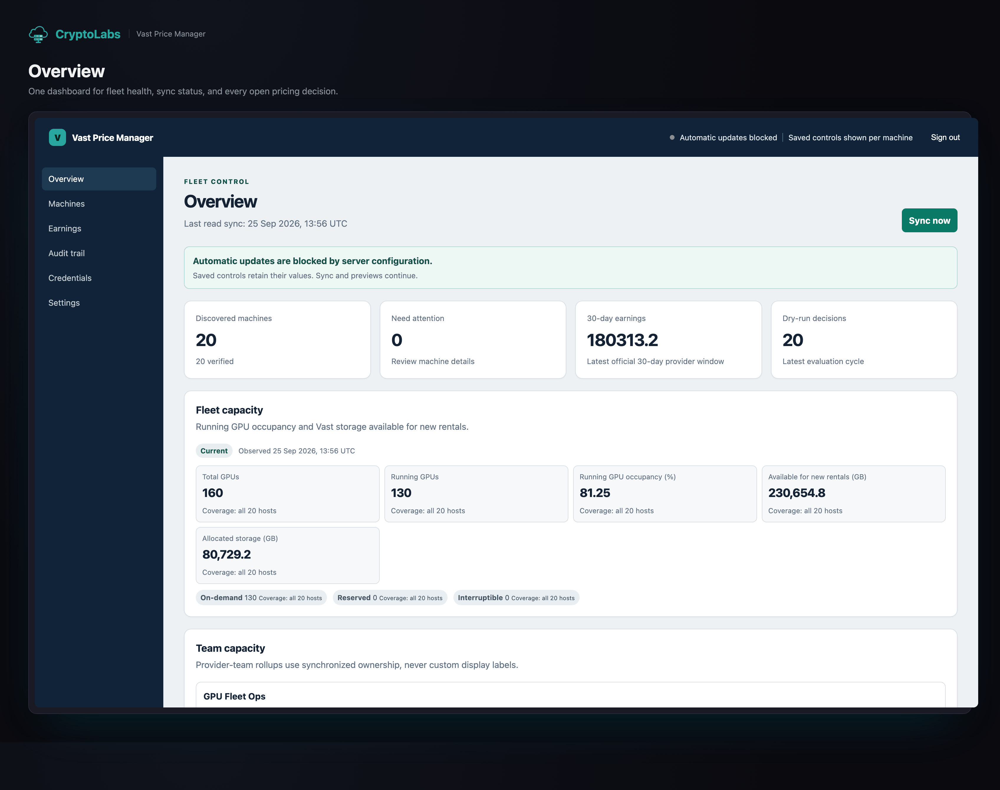
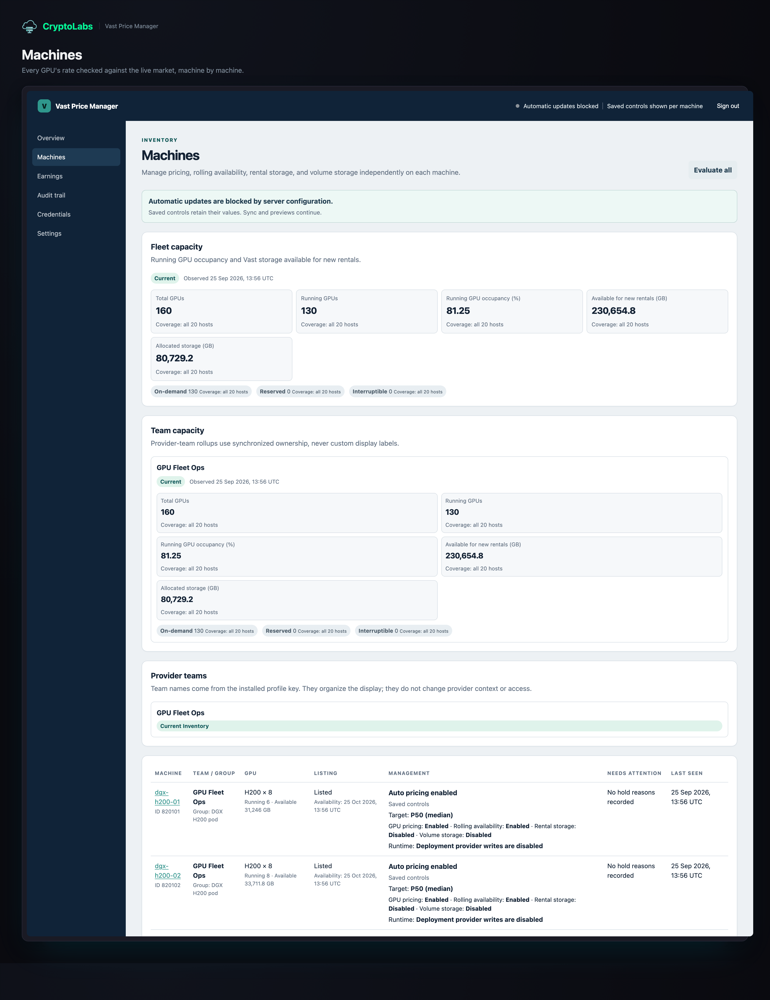
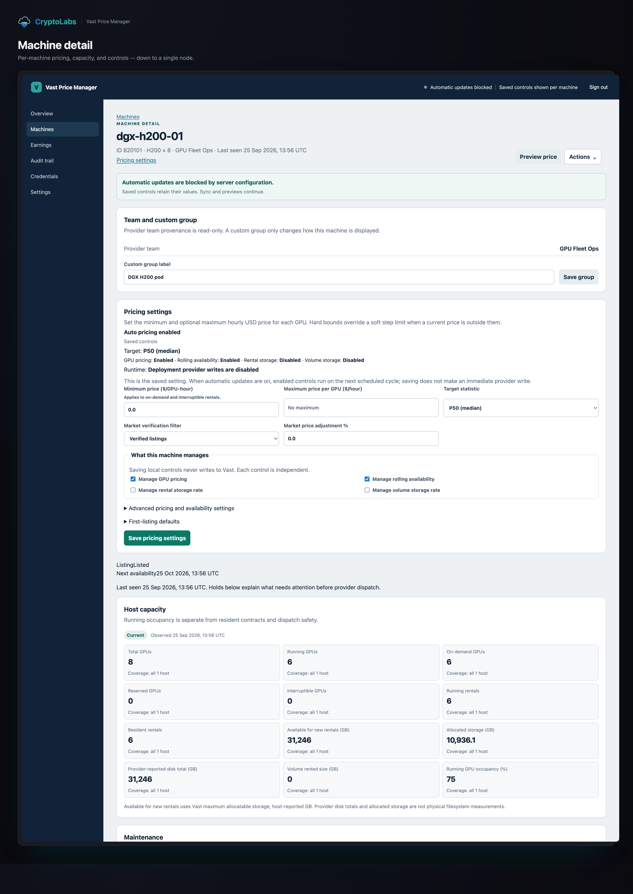
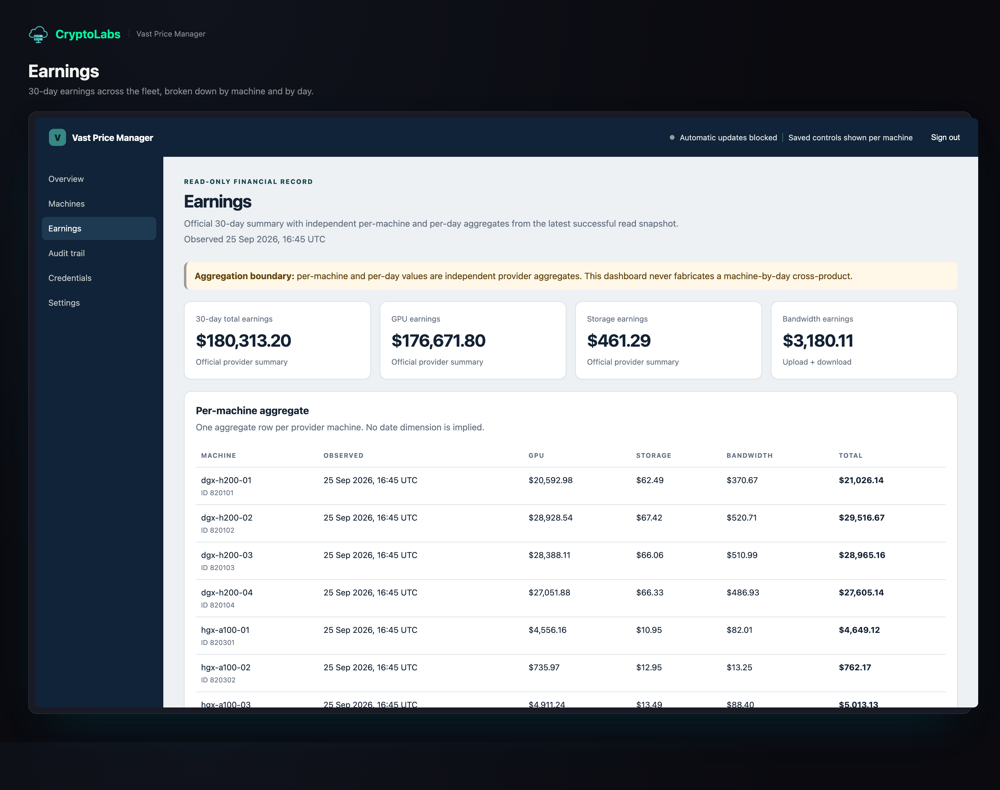
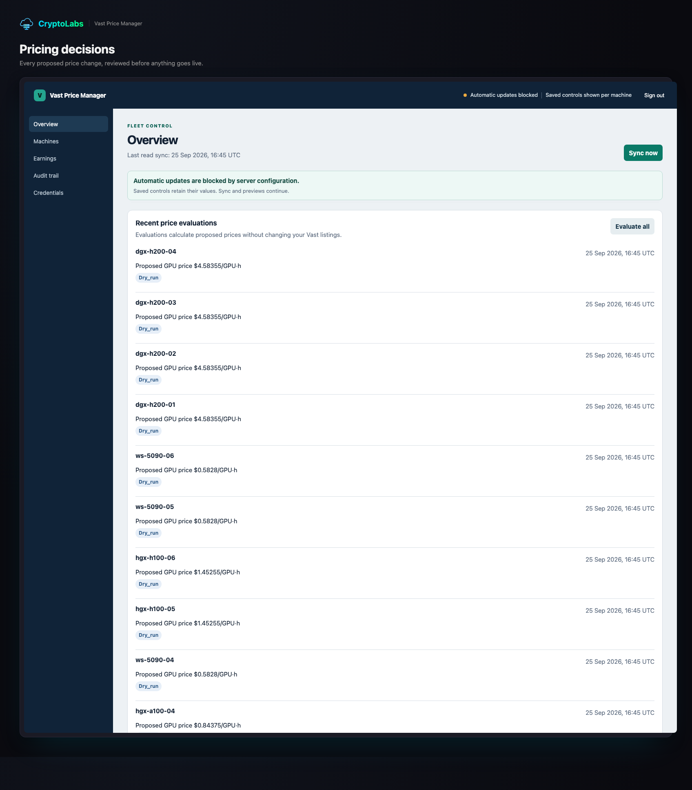
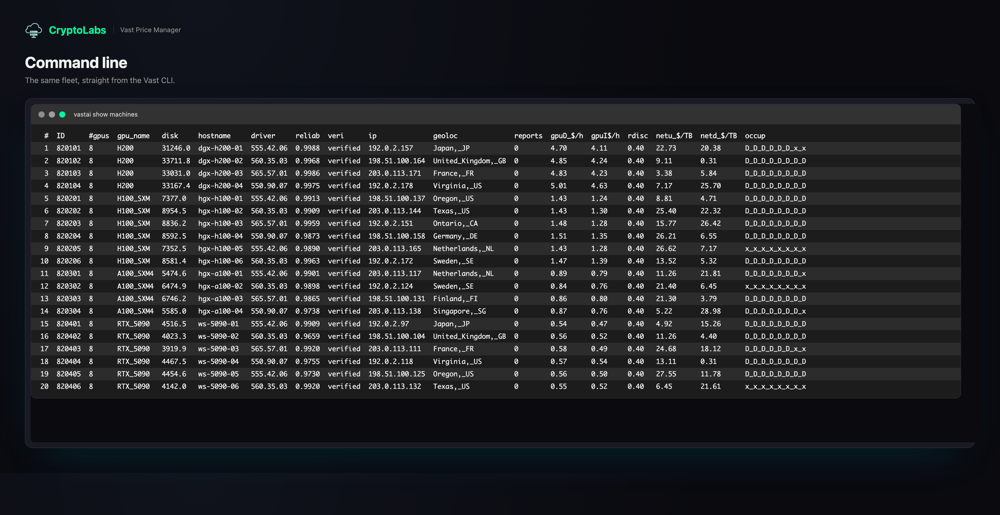

# Vast Price Manager (VPM)

*A self-hosted dashboard that watches your Vast.ai machines, prices them for you, and never touches a live listing until you say so.*

<p align="center"></p>

## What it does

- **Watches.** Syncs your machine inventory, ownership, and earnings from Vast.ai — read-only.
- **Prices.** Tracks the market price per GPU type and drafts dry-run pricing/end-date decisions until you turn writes on.
- **Tests.** Runs Vast's own machine self-test once you install the optional Vast CLI — see [docs/self-test.md](docs/self-test.md).
- **Logs.** Keeps an audit trail of every decision and command it runs.
- **Locks.** One admin account, with the password re-checked before every sensitive action.

## Quickstart

The 0.4.0 appliance starts with one container. Its image is pinned to the
published release digest below; verify its signature as described in
[RELEASES.md](RELEASES.md). Do not substitute `:latest`.

```sh
docker run -d --name vpm --restart unless-stopped --stop-timeout 60 \
  -p 8443:8088 \
  -v vpm_data:/data \
  -v vpm_keys:/keys \
  ghcr.io/cryptolabsza/vast-price-manager:0.4.0@sha256:20c1e3a4b66ddd723ea1e3c635e0b7dec3f8cc88fe29f4e27e54f1686954eead
```

Then open **`https://YOUR-SERVER:8443`** (or `https://localhost:8443` on
the Docker host), accept the local-certificate warning, and read the one-time
login from `docker logs vpm`. Sign in as `admin`, choose your own username and
password, add your Vast key, sync the discovered machines, then set their
prices. No API key, `.env` file, or runtime secret is needed to create the
container. The complete browser flow is in [docs/setup-wizard.md](docs/setup-wizard.md).

Need Docker Compose, an existing Caddy setup, or explicit environment/CLI
control? The [manual standalone guide](docs/first-run.md) keeps the existing
`.env` and Caddy layout. For a server or VM, see [docs/install-server.md](docs/install-server.md).

## Screenshots

VPM's real interface, on a sample fleet spanning DGX H200, H100 SXM, HGX A100, and RTX 5090 machines. The CLI screenshot uses the real `vastai show machines` column layout.

<p align="center">





</p>

## Safe by default

- **Off by default.** Writes stay disabled until you enable them in Settings and opt in a reviewed machine.
- **Held, not guessed.** Any missing or contradictory fact makes VPM leave a machine alone.
- **Encrypted key.** Your Vast API key is encrypted at rest; the appliance keeps its master key on the separate `vpm_keys` volume.
- **HTTPS-only.** The appliance serves HTTPS itself; the manual standalone recipe keeps Caddy in front of VPM. Full details: [docs/safety.md](docs/safety.md).

## Docs

- [docs/setup-wizard.md](docs/setup-wizard.md) — appliance container, browser login, key, sync, and pricing setup.
- [docs/first-run.md](docs/first-run.md) — manual `.env`, Caddy, CLI, and advanced setup.
- [docs/install-server.md](docs/install-server.md) — running VPM on your own server or VM instead of a laptop.
- [docs/configuration.md](docs/configuration.md) — every environment setting, its default, when to change it.
- [docs/self-test.md](docs/self-test.md) — installing the optional Vast CLI and running machine self-test.
- [docs/upgrade-and-backup.md](docs/upgrade-and-backup.md) — pinning by digest, backups, restoring.
- [docs/verify-image.md](docs/verify-image.md) — checking the image's signature.
- [docs/troubleshooting.md](docs/troubleshooting.md) — common problems and fixes.
- [RELEASES.md](RELEASES.md) — version → signed image table.
- [SECURITY.md](SECURITY.md) — reporting a vulnerability.

## Licence

Free to use, closed source — see [LICENSE](LICENSE).
